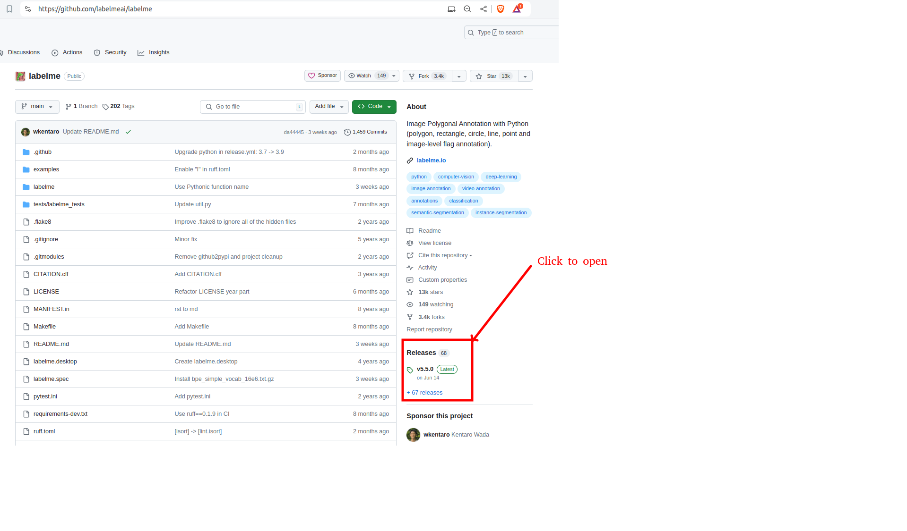
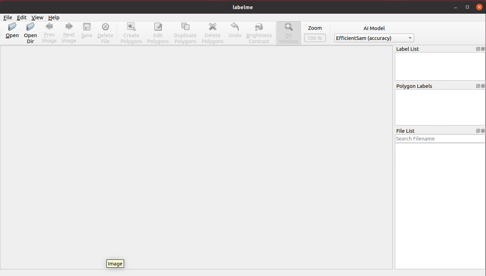
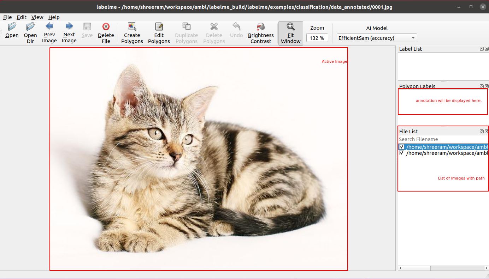
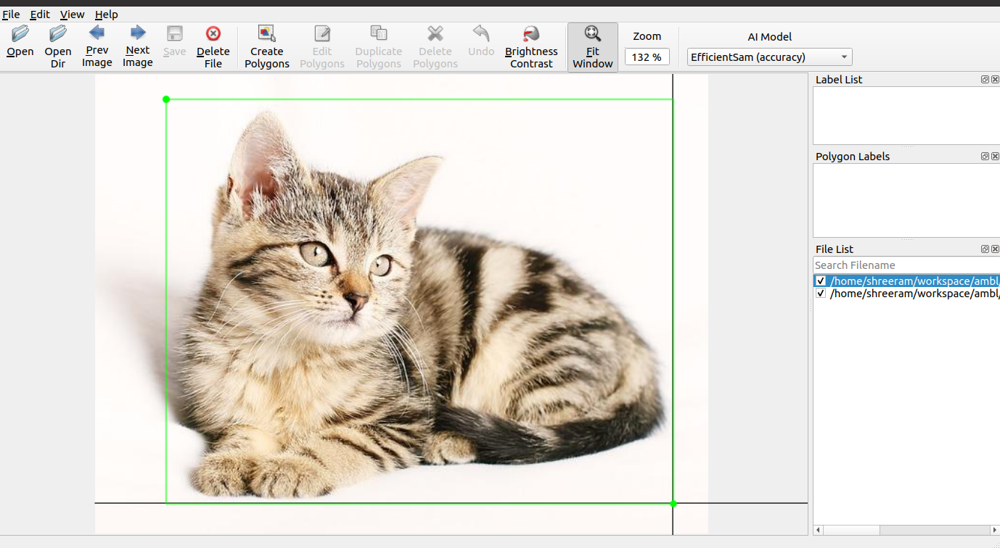
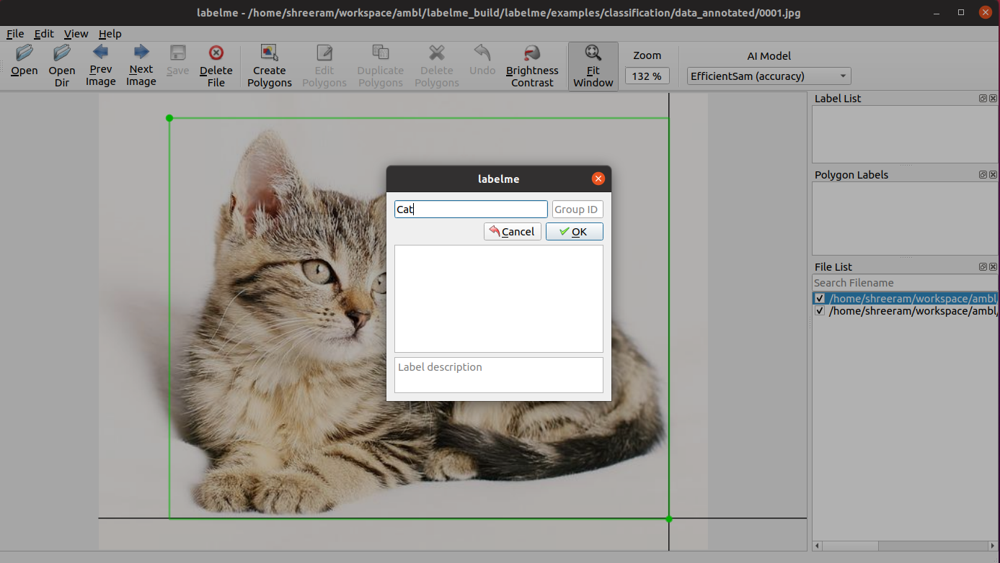
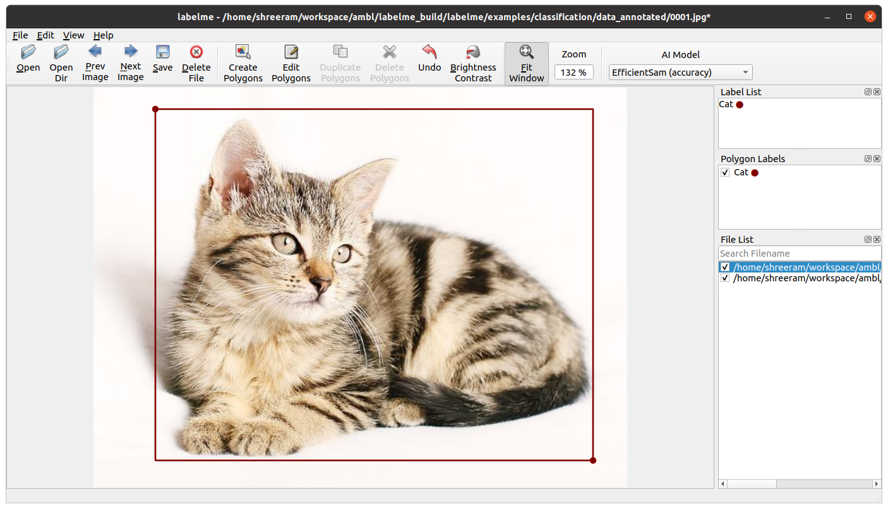
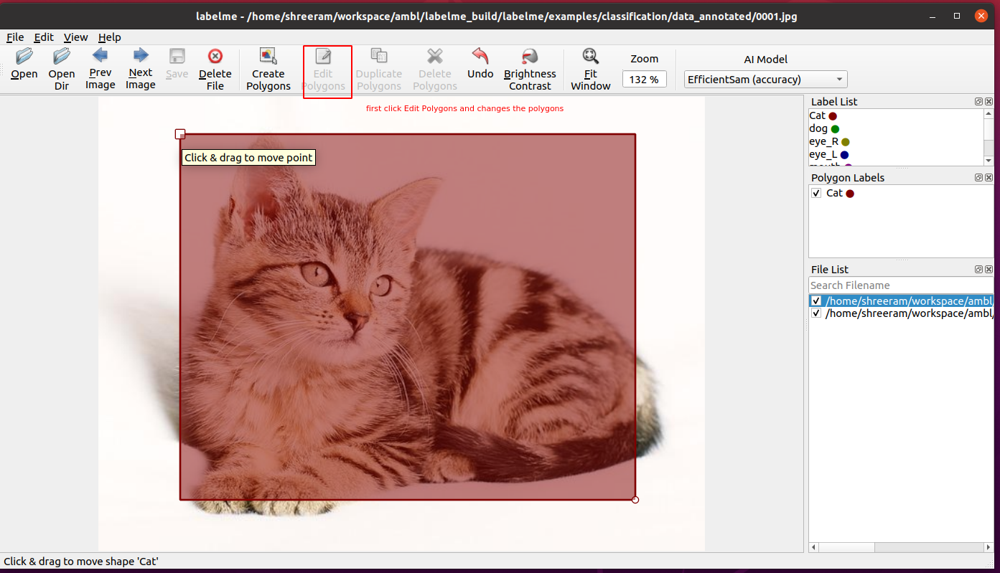
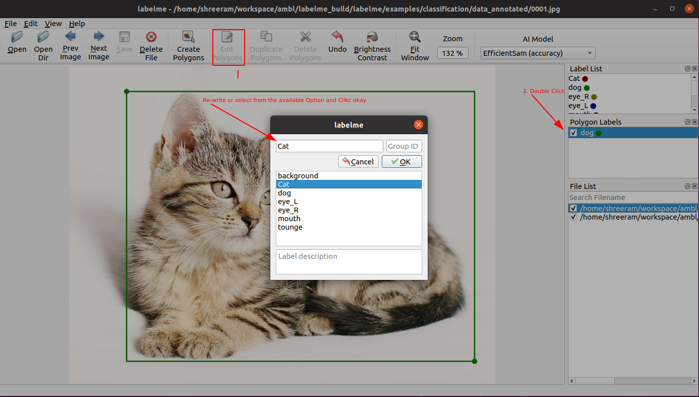

## Installation

Step 1. Visit

[Labelme Official Github Repo](https://github.com/labelmeai/labelme)

Step 2.  CLick the Releases (version while making this document -> v5.5.0)

Step 3.  Check Assets of the appropriate verision (we will use v5.5.0). Download as per your operating system.

For Windows version click  Labelme.exe and download. 

Step 4. Click the downloaded Labelme.exe file and allow or continue installation if any prompt arise.

With this installation process should be completed. 

## Basic Uses:

1. Run labelme application
   

2. Load single or multiple file:
   Click Open to select a single file.
   or Click Open DIr to load all the files from the directory.  Select the Path and Open
3. Open directory:
   

## Object Detection

1. lets draw a bounding box over a object/ this time cat.

    Ctrl +R or Right Click and select create rectangle

    

2. Click on another end to complete the bounding box. You will get a prompt window where you can enter new label name or select the exisitng label.  You can also add the description in the description section but it is optional. Click Ok

3. With Okay button the the annotation process is completed. You can use keyboard ctl + N or ctrl + P to change  next or previous images.

### Best way to Save the Annotation

1. As annotation is completed lets save the image.  You can just click the save button from tool bar. But by default label me saves image data in json which makes the file weight heavier and slow in processing. Therefore, the best way is to change the settings.

2. From Menu Click File> Uncheck "Save With Image Data"
3. Now you can click Save icon to save or there is another method to save the changes automatically.
4. Once again From Menu Click File > Save Automatically (Some time Save automatically feature may not work so just make sure the Save Automatically Icon has kind of shadow in background )

### How to Edit

1. Load the file you want to edit or add aditional labels.
2. To edit first Click Edit Polygons from top toolbar.  And adjust the polygons

   

    3. If Save automatically feature is enabled you do not need to save. The Save icon will be disabled as it is automatically saved/updated.

    4. To add aditional annotation. Just follow the annotation process

    5. To delete the polygon. Select the polygon and Click Delete polygons from top tool bar.

### How to delete the whole annotaiton file?

 Ctrl + D or Click Delete File from top toolbar. It will remove the annotated json file. 

### How to update the labels?

1. Make sure you have clicked Edit Polygons from top toolbar.
2. After that, From Polygon Labels Select the Label and double click it.
3. Select or Write new Label as required and click ok to save.

### Where to find the annotation and its format?

All of the annotation are found in the same directory as Images so, while editing make sure your images and annotations are on same directory 

Image and Annotation file name should be same, while annotating with json file it follows the same concept so no need to worry about it but while utiling the images and annotations from other sources, make sure the annotation file is saved in .json extension and the json structure is Json format.

While working with multiple formate you can use [roboflow](https://roboflow.com/convert/labelme-json-to-coco-json) for format conversion. Or you can create your own script to convert.
